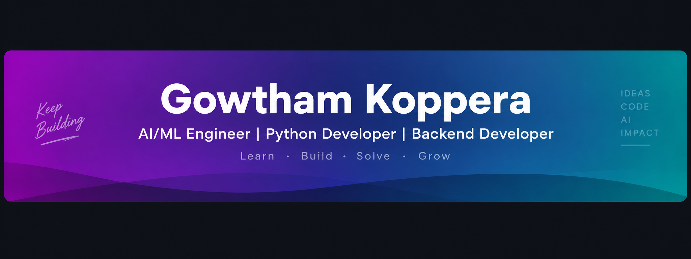

<!--
  GitHub Profile README
  Author: Gowtham Koppera
  GitHub: Gowtham07386
-->

<!-- ===================== GOWTHAM KOPPERA GITHUB PROFILE ===================== -->

<!-- CUSTOM GRADIENT BANNER -->

 

<!-- ===================== NAVIGATION BUTTONS ===================== -->

  
  
  

<!-- SECOND ROW -->

  
  
  

<!-- PROFILE VIEWS -->

  

---

<!-- ===================== TYPING ANIMATION ===================== -->

---

<!-- ===================== ABOUT ME ===================== -->

## 🧠 About Me

- 🎓 Computer Science and Engineering graduate specializing in **Artificial Intelligence** from Parul University.
- 🤖 Passionate about **Artificial Intelligence, Machine Learning, Generative AI, and LLM applications**.
- 💻 Experienced in Python, backend API development, databases, and AI-based application development.
- 🚀 Worked as an **AI Intern / Team Lead at Infosys Springboard**, contributing to the MetroFlow AI platform.
- 🛠️ Interested in developing intelligent systems that solve real-world problems.
- 🤝 Enjoy collaborating on technical projects, coordinating teams, and learning emerging technologies.

### 🎯 Career Focus

My goal is to grow as an **AI/ML Engineer and Backend Developer**, building scalable AI-powered applications and continuously improving my skills in machine learning, software engineering, and intelligent automation.

---

<!-- ===================== EXPERIENCE ===================== -->

## 💼 Experience

### 🔹 AI Intern — Infosys Springboard

📅 **July 2026 – September 2026**

**Project:** MetroFlow — AI Platform for Metro Crowd Management and Scheduling

- Led a team in developing an AI-based platform for metro crowd management and scheduling.
- Developed backend APIs using **Python and FastAPI**.
- Worked with **PostgreSQL** for database management.
- Contributed to frontend integration and backend service connectivity.
- Coordinated project development, testing, Git workflows, and integration.
- Participated in metro data gathering and validation.

---

<!-- ===================== TECH STACK ===================== -->

## 🛠️ Tech Stack

### 👨‍💻 Programming Languages

  

  
  
  

### 🤖 Artificial Intelligence & Machine Learning

  
  
  
  
  
  

### 📊 Libraries & Frameworks

  
  
  
  
  

### 🌐 Frontend & Backend

  

### 🗄️ Databases & Cloud

  

  
  

### 🎨 Creative & Professional Skills

  
  
  
  

---

<!-- ===================== FEATURED PROJECTS ===================== -->

## 🚀 Featured Projects

### 1️⃣ MetroFlow — AI Metro Crowd Management & Scheduling

  
  
  
  

**Description:**

MetroFlow is an AI-based platform designed to support metro crowd management and scheduling through data-driven solutions. The project was developed during my Infosys Springboard virtual internship.

**My Contributions:**
- Team Lead and Backend Developer.
- Developed FastAPI backend services.
- Integrated PostgreSQL database.
- Supported frontend and backend integration.
- Coordinated development and project integration.

**Tech Stack:** Python • FastAPI • PostgreSQL • React.js • Vite • Docker • Render

🔗 **Live Demo:** [MetroFlow](https://metro-crowd-management-1.onrender.com)

---

### 2️⃣ Brain Tumor Detection System

  
  
  
  

**Description:**

An AI-assisted MRI image classification application using deep learning and the VGG16 architecture to support brain tumor detection.

**Key Contributions:**
- Developed image preprocessing and model inference workflows.
- Worked with VGG16 for image classification.
- Integrated the prediction model with a Flask application.
- Used MongoDB for application data management.

**Tech Stack:** Python • TensorFlow • VGG16 • Flask • MongoDB

🔗 **Live Demo:** [Brain Tumor Detection System](https://brain-tumour-detection-using-dp-mri.onrender.com)

> Note: The resume reports 97% training accuracy. Training accuracy should not be presented as model generalization or clinical accuracy.

---

### 3️⃣ Multi-Language Translator

  
  
  
  

**Description:**

An AI-powered multilingual translation application built using Hugging Face Transformers and the NLLB-200 model. The application provides an interactive interface for translating text across multiple languages.

**Key Contributions:**
- Developed NLP-based translation workflows.
- Integrated Hugging Face transformer models.
- Built an interactive Gradio interface.
- Worked with multilingual text processing.

**Tech Stack:** Python • Hugging Face Transformers • NLLB-200 • NLP • Gradio

🔗 **GitHub Repository:** [Multi-Language Translator](https://github.com/Gowtham07386/Multi-Language-Translator)

---

<!-- ===================== GITHUB STATS ===================== -->

## 📊 GitHub Statistics

---

<!-- ===================== STREAK STATS ===================== -->

## 🔥 GitHub Streak

---

<!-- ===================== CONTRIBUTION GRAPH ===================== -->

## 📈 Contribution Activity

---

<!-- ===================== ACHIEVEMENTS ===================== -->

## 🏆 Achievements & Certifications

### 🎓 Certifications

- **Artificial Intelligence with Python** — Coincent.ai *(March 2023)*
- **Prompt Engineering & Programming with OpenAI** — Columbia+ *(October 2025)*
- **Artificial Intelligence Primer Certification** — Infosys Springboard *(April 2026)*

### 🌟 Leadership & Activities

- Coding Club Coordinator — Parul University.
- Coordinated coding sessions, workshops, and technical activities.
- Supported student teams, technical guidance, and event organization.
- Team Lead during the Infosys Springboard virtual internship.

---

<!-- ===================== CURRENTLY LEARNING ===================== -->

## 📚 Currently Learning

- 🤖 Machine Learning & Artificial Intelligence
- 🧠 Generative AI & LLM Applications
- ⚙️ Backend Development with Python and FastAPI
- 🗄️ Database Design & API Integration
- ☁️ Cloud Deployment & Application Development
- 🧩 Data Structures & Algorithms

---

<!-- ===================== INTERESTS ===================== -->

## 🎯 Areas of Interest

- Artificial Intelligence & Machine Learning
- Generative AI & Large Language Models
- AI-Powered Automation
- Backend Development & API Engineering
- Data Processing & Intelligent Systems
- Video Editing & Creative Content

---

<!-- ===================== OPEN TO COLLABORATE ===================== -->

## 🤝 Open to Collaborate On

- 🤖 AI/ML Projects
- 🚀 Generative AI Applications
- 💻 Python & Backend Development
- 🌐 Full-Stack Applications
- 🔬 Research & Innovative Projects
- 🌍 Open-Source Contributions
- 💡 Startup Ideas & Technical Collaborations

---

<!-- ===================== CONNECT ===================== -->

## 📫 Connect With Me

---

<!-- ===================== PROFILE FOOTER ===================== -->

### 💡 "Building intelligent solutions, one project at a time."

⭐ **If you find my projects interesting, feel free to explore my repositories and connect with me!**

